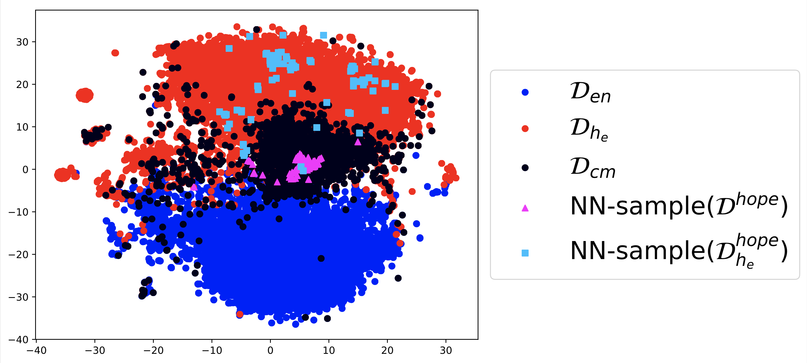

# Code Mixing Toolbox

This tool leverages machine learning on code-switching to enable its use for information retrieval.

Code-switching is a phenomenon where a speaker uses two or more languages within the same sentence or document boundary. Commonly used by multilingual speakers, the phenomenon is considered an impediment to downstream NLP analysis.

Recent work allows us to model multilinguality and code-mixing and utilize it for cross-lingual information retrieval tasks.

This repository contains code to compute metrics related to code-switching, and utilize it for information retrieval tasks.

The source code here operates on (i) a corpus in the form of a text file - one document per line, and (ii) skipgram word embeddings trained on this corpus.

## Table of Contents

* [Background](#background)
* [Dependencies](#dependencies)
* [Execution](#execution)
* [Examples](#examples)


## Background

Word embeddings obtained using neural network methods [1,4] have found their way into a variety of natural language processing (NLP) pipelines. Successful applications have used these embeddings as features for downstream tasks like text classification [3], topic modeling [2], and semantic role labeling [6]. Recent studies on training polyglot word embeddings, have discovered that they provide performance improvements in some standard tasks, and discover highly accurate language-identification modules without any additional training. We explored their utility in an additional setting: code-mixed text (text combining multiple languages). In this report, we discuss two applications: (1) retrieving code-mixed text from a multilingual corpus and (2) transferring annotations in one language to another. We can achieve both achieved with minimal supervision. This has applicability for multilingual data science problems and is particularly useful due to the limited annotation requirements.

Polyglot word embeddings are obtained when a single model is trained on a large multilingual corpus. We, with collaboration with Ashiqur KhudaBukhsh, a computer scientist at CMU, focused on the continuous 100-dimensional real-valued embeddings obtained from FastText [1] trained using the SkipGram [5] objective. The SkipGram model predicts a context given an input word. In a polyglot setting, a word’s context primarily reflects the language used. In [5], polyglot embeddings were shown to capture a highly accurate language-identification module with no supervision.

Document embeddings obtained by averaging word embeddings have been used for topic modeling in [2]. In [5], averaged word-embeddings were used for low-resource language identification. We have extended these averaged word embeddings to two new applications: (1) retrieving code-mixed documents automatically and (2) transferring annotations in one language to another by exploiting code-mixing. Code-mixing is a commonly occurring phenomenon in informal text generated by multilingual audiences. A text classifier that primarily annotates an English corpus (as is the case with most applications) can be used to bootstrap annotations in a second language exploiting the properties of polyglot embeddings.

Sampling Code-Mixed Documents Embedding Space
The polyglot document-embedding space typically contains one cluster per salient language [5]. A cursory investigation reveals that the boundary or interface between two clusters includes code-mixed documents. We can extract these documents using simple distance based heuristics.


Transferring Annotations
Once code-mixed documents are sampled, annotators proficient in one language (say English) can annotate a document by only focusing on the English portions. The polyglot embeddings (in addition to a document-level language identification module) capture a highly robust token-level language identification module. Thus, we can extract phrases from the annotated text that belong to the source and target languages. For a given annotated document (the annotation is a class label in a text-classification setting), we first extract the target language phrases. Next, using a nearest neighbor retrieval technique, we sample documents written only in the target language (the distance metric is cosine distance - standard in many NLP tasks) most similar to the phrases from the code-mixed text. Our experiments revealed that compared to random sampling, this nearest neighbor sampling retrieves a substantially larger portion of positive documents even in highly skewed settings.

## Dependencies

* Please install `fastText` - available from this github repo: [https://github.com/facebookresearch/fasttext](https://github.com/facebookresearch/fasttext). Run the installation procedure and make sure `fastText` is available inside your Python environment using `import fastText`

* Please obtain the `polyglot_toolbox` - available from this github repo: [https://github.com/onai/polyglot-toolbox](https://github.com/onai/polyglot-toolbox)

## Execution

* Given a corpus file - a text file with one document per line, monolingual components can be discovered and an unsupervised language identification system trained using the steps outlined in [https://github.com/onai/polyglot-toolbox](https://github.com/onai/polyglot-toolbox)

* The first step is computation of the _Code Mixing Index_ - a metric ranging from 0 to 0.5 with 0.5 indicating perfect code-switching between the two languages.

```
python sample_code_mixed_words_model_meta.py /path/to/fasttext/skipgram/model.bin /path/to/kmeans.model.joblib /path/to/documents/to/label.txt <cluster_id_1> <cluster_id_2> > /path/to/save/cmi_labeled_documents.txt
```

Here, the skipgram and kmeans models are from `fastText` and the `polyglot_toolbox` dependencies. The `<cluster_id_1>` and `<cluster_id_2>` parameters are integer values corresponding to the language labels of interest. Thus if the languages desired are labeled 0 and 1 by the `polyglot_toolbox` repository, `<cluster_id_1>` and `<cluster_id_2>` are 0 and 1 respectively.

The command above will also store the CMI annotated comments in `/path/to/save/cmi_labeled_documents.txt`. This file contains one annotated document per line. The first token is the floating point CMI value, and the tokens of the document follow.

The high CMI (>= 0.4) can be filtered out using:

```
python filter_cm.py /path/to/save/cmi_labeled_documents.txt > /path/to/save/cmi_labeled_documents.0.4.txt
```

* Next, starting from a set of code-mixed source documents, we intend to retrieve  documents in a target language (say Hindi).

First, discard any tokens not written in the language of choice

```
python remove_non_hindi_words.py /path/to/code-mixed-documents.txt /path/to/skipgram/model.bin /path/to/kmeans/model.joblib > /path/to/code-mixed-documents.hindi.txt
```

Next, sample the Hindi-majority documents using the following command:

```
python sample_corpus.py /path/to/code-mixed-documents.hindi.txt  /path/to/hindi/documents.txt /path/to/skipgram/model.bin /path/to/code-mixed-documents.txt > /path/to/save/sampled-hindi-documents.ndjson
```

The above command samples Hindi documents using the Hindi components of the code-mixed documents discovered in the above step.

## Examples



In the above example, we show an embedding space. The blue points correspond to English documents, the red points are Hindi documents. Starting from a source set of documents which are code-mixed (magenta), we find semantically similar content in the Hindi region (blue).